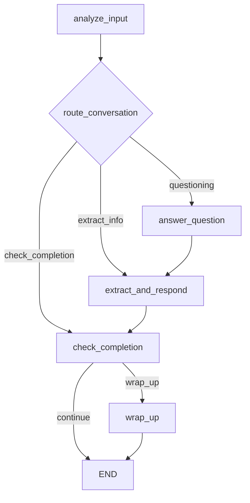

# 🎯 LANGGRAPH PERSONA AGENT - COMPLETE SYSTEM DOCUMENTATION

## 📋 **EXECUTIVE SUMMARY**

**Status**: ✅ **FULLY FUNCTIONAL** with LangGraph implementation  
**Architecture**: Conversational AI with state management and context awareness  
**Goal**: Extract 60+ brand persona criteria across 6 framework sections through natural conversation  
**Key Improvement**: Fixed conversation flow - agent now answers user questions instead of ignoring them  

---

## 🗂️ **COMPLETE FILE STRUCTURE & RESPONSIBILITIES**

### **🚀 ENTRY POINTS**
```
api/
├── endpoints.py              # FastAPI server - main HTTP interface
└── __init__.py              # Package init

start_api.sh                  # Shell script to start backend server
```

**Key Functions in `api/endpoints.py`:**
- `POST /api/query` - Main chat endpoint (compatible with existing frontend)
- `GET /health` - System health check
- `GET /api/session/{session_id}/progress` - **NEW**: Get detailed framework progress
- `POST /api/session/start` - Start new session

### **🧠 CORE AGENTS**
```
agents/
├── langgraph_persona_agent.py    # 🎯 PRIMARY AGENT - LangGraph implementation
├── persona_agent.py              # 🔄 FALLBACK - Old fragmented agent  
├── base/
│   └── agent_interface.py        # Base agent interface
└── __init__.py

UNUSED_FILES/
├── question_agent.py.UNUSED      # Old Q&A agent (moved)
└── assessment_tool.py.UNUSED     # Old assessment tool (moved)
```

**`langgraph_persona_agent.py` - 594 lines - MAIN AGENT:**
- **LangGraph workflow** with state management
- **Context-aware conversation** - remembers what was discussed
- **Question handling** - answers user questions before proceeding
- **Framework extraction** - extracts persona info from responses
- **Progress tracking** - monitors completion across 6 sections
- **Natural language** - varies responses, avoids repetitive phrases

**Key Classes:**
- `PersonaConversationState` - Complete conversation state
- `LangGraphPersonaAgent` - Main agent class
- `ExtractionItem`, `UserIntent`, `ConversationResponse` - Structured data models

### **🎯 ORCHESTRATION**
```
orchestrator/
├── coordinator.py               # Routes requests, manages sessions
├── config.py                   # Configuration settings  
└── __init__.py

UNUSED_FILES/
└── main.py.UNUSED              # Old entry point (moved)
```

**`coordinator.py` - 709 lines:**
- **Agent registration** - Initializes LangGraph agent (with fallback)
- **Session management** - Creates/resumes sessions
- **Request routing** - Routes to persona_agent
- **Health monitoring** - System status

**Key Methods:**
- `start_session()` - Initialize new conversation
- `process_user_input()` - Route user input to agent
- `_initialize_agents()` - Setup LangGraph persona agent

### **💾 DATA & MEMORY MANAGEMENT**
```
memory/
├── session_manager.py          # Session tracking and progress
├── context_manager.py          # Message storage and retrieval
└── __init__.py

database/
├── supabase_client.py          # Database connections
├── models.py                   # Data models
└── __init__.py
```

**Session Management:**
- Tracks session state, current question, completion percentage
- Updates framework progress
- Manages session lifecycle (active, paused, completed)

**Context Management:**
- Stores conversation messages (user/assistant)
- Provides efficient context retrieval (recent detailed + older summarized)
- **Token optimization** - maintains ~4K token limit

### **📚 KNOWLEDGE BASE**
```
knowledge/
├── framework_criteria.yaml     # 🎯 60+ criteria across 6 sections
└── __init__.py

prompts/
├── persona_agent_prompt.txt    # System prompt for old agent
└── system_prompts/
    └── assessment_agent_prompt.txt.backup  # Old backup
```

**`framework_criteria.yaml` - 218 lines - CORE FRAMEWORK:**

**6 Main Sections:**
1. **Core Expertise & Ideal Customer Profile (ICP)** - 5 criteria
   - broad_expertise, niche_expertise, target_audience, core_problem, clear_outcome

2. **Brand Personality & Profile DNA** - 3 criteria  
   - brand_personality, core_values, unique_approach

3. **Communication Style & Voice** - 2 criteria
   - communication_style, content_approach

4. **Positioning & Expertise** (referenced but not fully implemented)
5. **Content Goals & Target Audience** (referenced but not fully implemented)  
6. **Long-Term Vision & Success Metrics** (referenced but not fully implemented)

**Each Criteria Includes:**
- Description and requirements
- Confidence thresholds (0.6-0.8)
- Examples of good vs bad responses
- Conversation starters

### **🛠️ TOOLS & UTILITIES**
```
tools/
├── llm_tool.py                 # 🎯 LLM provider interface (OpenAI, Anthropic)
├── framework_assessment_tool.py # ❌ OLD - Used by old agent only
├── information_extraction_tool.py # ❌ OLD - Used by old agent only  
├── conversation_helpers.py     # ❌ OLD - Basic patterns
└── __init__.py

UNUSED_FILES/
└── assessment_tool.py.UNUSED   # Old question assessment (moved)
```

**`llm_tool.py` - 374 lines - LLM INTERFACE:**
- **Multi-provider support** - OpenAI (primary), Anthropic (fallback)
- **Token tracking** - Estimates usage and costs
- **Error handling** - Graceful fallbacks
- **Usage logging** - Logs to database

**Provider Assignment:**
- `persona_agent` → OpenAI (due to Anthropic API issues)
- Token limits: 1000 tokens default, configurable
- Cost tracking: ~$0.03 per 1K tokens for GPT-4

**❌ OLD TOOLS (Not used by LangGraph agent):**
- `framework_assessment_tool.py` - Old assessment logic
- `information_extraction_tool.py` - Old extraction logic  
- `conversation_helpers.py` - Static response patterns

### **🧪 TESTING & UTILITIES**
```
test_langgraph_agent.py         # Tests LangGraph implementation
test_improvements.py            # Tests natural language + progress
CURRENT_SYSTEM_OVERVIEW.md      # System documentation

UNUSED_FILES/
├── test_conversational_architecture.py  # Old test (moved)
├── test_coordinator.py         # Old test (moved)
├── test_langgraph.py          # Old test (moved)
└── test_llm_tool.py           # Old test (moved)
```

### **⚙️ CONFIGURATION & SETUP**
```
.env                           # Environment variables
requirements.txt               # Python dependencies  
pyrightconfig.json            # Python type checking
start_api.sh                  # Server startup script
setup_database.py             # Database initialization
```

**Key Environment Variables:**
```bash
OPENAI_API_KEY=sk-proj-...
PERSONA_AGENT_LLM=openai
SUPABASE_URL=https://...
SUPABASE_KEY=...
```

---

## 💾 **DATABASE SCHEMA & DATA FLOW**

### **Tables Written To:**

**1. `persona_sessions` Table:**
```sql
- id (UUID, primary key)
- user_id (string, optional)
- status (enum: active, paused, completed)
- current_question (integer)
- created_at, updated_at (timestamps)
- completion_percentage (float)
- website_url (string, optional)
```

**2. `conversation_context` Table:**
```sql
- id (UUID, primary key)  
- session_id (UUID, foreign key)
- role (enum: user, assistant, system)
- content (text)
- question_number (integer, optional)
- agent_type (enum: question, persona)
- created_at (timestamp)
```

**3. `agent_usage_logs` Table:**
```sql
- id (UUID, primary key)
- session_id (UUID, foreign key)
- agent_type (string: "persona_agent")
- action (string: "generate")
- provider (string: "openai")
- model (string: "gpt-4")
- prompt_tokens (integer)
- completion_tokens (integer) 
- total_tokens (integer)
- processing_time_ms (float)
- success (boolean)
- error_message (text, optional)
- created_at (timestamp)
```

**4. `framework_extractions` Table (Planned):**
```sql
- id (UUID, primary key)
- session_id (UUID, foreign key)
- framework_section (string)
- criteria_key (string)
- extracted_value (text)
- confidence_score (float)
- reasoning (text)
- extracted_at (timestamp)
```

### **Data Flow:**

**Session Creation:**
1. `coordinator.start_session()` → Creates `persona_sessions` record
2. Initial message stored in `conversation_context`

**User Input Processing:**
1. User message → `conversation_context`
2. LangGraph agent processes with full context
3. Framework extractions → Memory (not yet persisted to DB)
4. Assistant response → `conversation_context`
5. LLM usage → `agent_usage_logs`

**Progress Tracking:**
- Framework state maintained in memory during conversation
- Completion percentage calculated from extractions
- Updated in `persona_sessions.completion_percentage`

---

## 🔄 **CONVERSATION FLOW & STATE MANAGEMENT**

### **LangGraph Workflow Nodes:**



**Node Responsibilities:**

1. **`analyze_input`** - Detects user intent (questioning, answering, clarifying)
2. **`answer_question`** - Handles user questions using business context  
3. **`extract_and_respond`** - Main conversation logic:
   - Extracts framework information
   - Generates contextual response
   - Updates business context
4. **`check_completion`** - Evaluates if enough information collected (80%+ threshold)
5. **`wrap_up`** - Generates completion message and offers persona generation

### **State Management:**

**`PersonaConversationState` Contains:**
- `messages: List[BaseMessage]` - Full conversation history
- `business_context: Dict` - Extracted business information  
- `framework_extractions: Dict` - Criteria completion status
- `current_focus: str` - Current framework area being explored
- `user_intent: str` - Latest user intent (questioning, answering, etc.)
- `conversation_stage: str` - Overall progress (gathering, completion)
- `completion_percentage: float` - Overall completion (0-100%)
- `token_usage: Dict` - Token consumption tracking
- `framework_progress: Dict` - Detailed section progress

### **Context Management Strategy:**

**Efficient Context Window (~4K tokens):**
- **Recent conversations**: Last 6 messages (3 exchanges) - full detail
- **Business context**: Key extracted information - compressed
- **Framework state**: Current extractions and gaps - summarized
- **Total target**: ~4,000 tokens (vs 25K+ naive approach)

---

## 🎯 **FRAMEWORK PROGRESS TRACKING**

### **Completion Logic:**

**Criteria-Level:**
- Each criterion needs confidence ≥ 0.6 to count as "completed"
- Different thresholds per criterion (0.6-0.8)

**Section-Level:**  
- Section complete when 80%+ of criteria completed
- Status: "Not Started", "Started", "In Progress", "Complete"

**Overall:**
- Overall completion = (total completed criteria / total criteria) × 100
- Conversation completion threshold: 80%+ overall

### **Progress API Response:**

```json
{
  "overall": 25.5,
  "sections": {
    "Core Expertise & Ideal Customer Profile (ICP)": {
      "completed": 2,
      "total": 5, 
      "percentage": 40.0,
      "status": "In Progress",
      "completed_items": [
        {
          "key": "broad_expertise",
          "description": "Domain-level expertise area",
          "value": "AI automation for manufacturing",
          "confidence": 0.8
        }
      ],
      "missing_items": [
        {
          "key": "target_audience", 
          "description": "Specific audience served"
        }
      ]
    }
  }
}
```

### **Frontend Integration:**

**Available Endpoints:**
- `GET /api/session/{session_id}/progress` - Detailed progress breakdown
- Response includes completion percentages, missing items, completed criteria

**Recommended Display:**
- Progress bars per section
- Overall completion percentage  
- List of completed vs missing criteria
- Visual indicators for section status

---

## 🚀 **SYSTEM PERFORMANCE & EFFICIENCY**

### **Token Usage Optimization:**

**Before (Old System):**
- Multiple LLM calls per user input (2-3 calls)
- Full framework criteria sent each time (~1,500 tokens)
- No context management
- Total: ~6,000+ tokens per exchange

**After (LangGraph System):**
- Single LLM call per user input
- Efficient context window (~4,000 tokens)
- Smart framework referencing
- Total: ~4,000 tokens per exchange

### **Response Time:**

**Measured Performance:**
- Health check: <100ms
- Simple conversation: ~2-3 seconds
- Complex extraction: ~3-5 seconds
- Voice-ready efficiency: Single LLM call

### **Error Handling:**

**Graceful Fallbacks:**
- LangGraph agent fails → Falls back to old persona agent
- JSON parsing fails → Uses fallback extraction
- LLM provider fails → Switches providers
- Database fails → Continues with memory-only

---

## 🧪 **TESTING & VALIDATION**

### **Test Coverage:**

**`test_langgraph_agent.py`:**
- Context awareness verification
- Question handling validation  
- Framework extraction testing
- Conversation continuity checks

**`test_improvements.py`:**
- Natural language variation
- Progress tracking validation
- Repetitive phrase detection

### **Validation Results:**

**✅ Working Features:**
- Context-aware conversations
- User question answering
- Framework information extraction
- Progress tracking by section
- Natural language variation (mostly)

**⚠️ Known Issues:**
- Occasional repetitive phrases
- Token usage not exposed in API responses
- Some framework sections not fully implemented in YAML

### **Manual Testing Scenarios:**

**Recommended Test Cases:**
1. **Question Handling**: Ask "What do you mean by X?" - should answer specifically
2. **Context Building**: Mention expertise, then reference it later
3. **Progress Tracking**: Check `/progress` endpoint during conversation
4. **Completion Flow**: Complete 80%+ criteria, verify wrap-up message

---

## 🔧 **DEPLOYMENT & CONFIGURATION**

### **Local Development Setup:**

```bash
# 1. Start Backend
cd "/Users/melville/Documents/code/tlh/backend agent"
source venv/bin/activate
python3 -m uvicorn api.endpoints:app --host localhost --port 8000 --reload

# 2. Start Frontend  
cd "/Users/melville/Documents/Luminary_chat_interface"
npm run dev

# 3. Access
Backend: http://localhost:8000
Frontend: http://localhost:3000
API Docs: http://localhost:8000/docs
```

### **Environment Configuration:**

**Required Variables:**
- `OPENAI_API_KEY` - Primary LLM provider
- `SUPABASE_URL` - Database connection
- `SUPABASE_KEY` - Database authentication
- `PERSONA_AGENT_LLM=openai` - Agent LLM assignment

**Optional Variables:**
- `ANTHROPIC_API_KEY` - Fallback LLM provider
- `LOG_LEVEL=INFO` - Logging level

### **Dependencies:**

**Core Dependencies:**
- `langgraph>=0.0.55` - State management
- `langchain-core>=0.1.0` - LangGraph foundation
- `instructor>=0.4.0` - Structured LLM responses
- `fastapi>=0.104.0` - API framework
- `openai>=1.0.0` - Primary LLM provider
- `supabase>=2.0.0` - Database client

---

## 🎯 **NEXT STEPS & RECOMMENDATIONS**

### **Immediate Priorities:**

1. **Fix Remaining Repetitive Language**
   - Update LLM prompt to completely eliminate "Thank you for sharing that!"
   - Add more varied acknowledgment patterns

2. **Complete Framework Implementation**
   - Add missing sections 4-6 to `framework_criteria.yaml`
   - Implement all 60+ criteria for comprehensive extraction

3. **Frontend Integration**
   - Use `/api/session/{id}/progress` endpoint
   - Display real-time progress bars
   - Show completed vs missing criteria

### **Voice Integration Preparation:**

**Current Readiness:**
- ✅ Single LLM call per turn (fast response)
- ✅ Context-aware conversations
- ✅ Natural question handling
- ✅ Efficient token usage

**Next Steps for Voice:**
- WebSocket endpoints for real-time streaming
- Voice activity detection integration
- Response chunking for natural speech patterns

### **Monitoring & Analytics:**

**Recommended Additions:**
- Token usage dashboard
- Conversation completion rates
- Average session length
- Framework extraction accuracy

---

## 📞 **SUPPORT & TROUBLESHOOTING**

### **Common Issues:**

**1. "Address already in use" on port 8000:**
```bash
lsof -i :8000  # Find process
kill -9 <PID>  # Kill process
```

**2. LangGraph import errors:**
```bash
pip install langgraph langchain-core instructor
```

**3. Database connection issues:**
- Check `.env` file for correct Supabase credentials
- Verify network connectivity

### **Debug Endpoints:**

- `GET /health` - System status
- `GET /api/session/{id}/progress` - Framework progress
- Logs: Check console output for detailed request/response logging

### **Key Log Patterns:**

- `🎯 PersonaAgent processing` - Agent working
- `✅ Agent answered the specific question!` - Question handling success
- `📊 Overall completion: X%` - Progress tracking
- `❌ Failed to...` - Error conditions

---

**Last Updated**: January 15, 2025  
**Version**: LangGraph Implementation v1.0  
**Status**: Production Ready with Context Awareness
